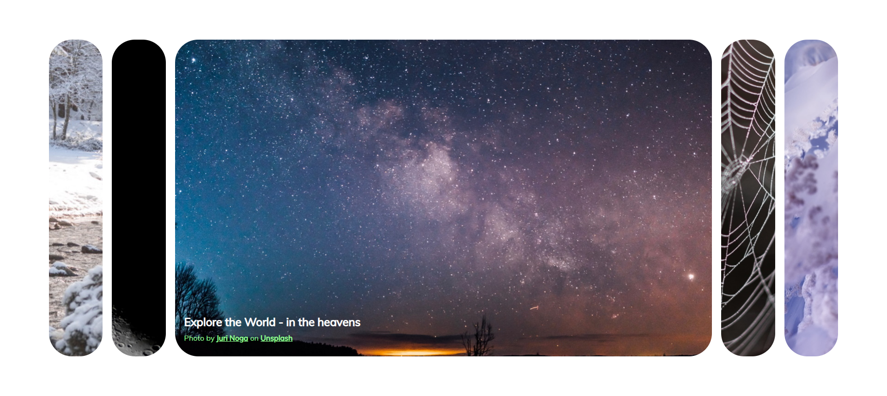
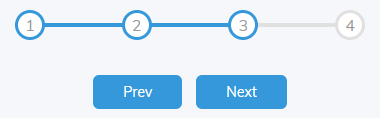
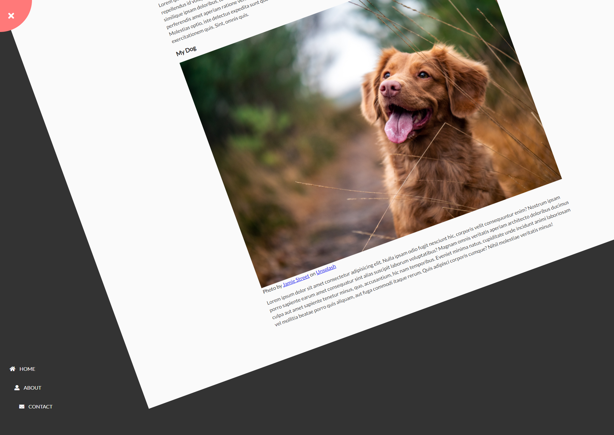

# Portfolio

###  Table of Contents  
[Web](#web)  
[Web JavaScript](#webjs)  
&nbsp;&nbsp;&nbsp;[01 - Expanding Cards](#webjs01)  
&nbsp;&nbsp;&nbsp;[02 - Progress Steps](#webjs02)  
&nbsp;&nbsp;&nbsp;[03 - Rotating Navigation](#webjs03)  
&nbsp;&nbsp;&nbsp;[04 - Hidden Secret Widget](#webjs04)  
&nbsp;&nbsp;&nbsp;[05 - Blurry Loading](#webjs05)  
&nbsp;&nbsp;&nbsp;[06 - Scroll Animation](#webjs06)  
[Node](#node)  
&nbsp;&nbsp;&nbsp;[Node JavaScript](#nodejs)  
&nbsp;&nbsp;&nbsp;&nbsp;&nbsp;&nbsp;[ITPT Course (Glasgow 2019)](#nodejscourse)  
&nbsp;&nbsp;&nbsp;[Node Utilities](#nodeutil)  
&nbsp;&nbsp;&nbsp;&nbsp;&nbsp;&nbsp;[Node calling Python](#nodeutil_01_python)  
&nbsp;&nbsp;&nbsp;&nbsp;&nbsp;&nbsp;[Node Desktop Directory Details](#nodeutil_02_dir)  
[Python](#python)  
&nbsp;&nbsp;&nbsp;[Python GUI](#pythongui)  
&nbsp;&nbsp;&nbsp;&nbsp;&nbsp;&nbsp;[Population Health App](#pythongui_01_healthapp)  
[Links](#links)  

***

#### Web ([Contents](#contents))

<!-- ====================================================================== -->

##### Web JavaScript ([Contents](#contents))

- ######  01 Expanding Cards ([Contents](#contents))

&nbsp;&nbsp;&nbsp;&nbsp;&nbsp;&nbsp;\
&nbsp;&nbsp;&nbsp;&nbsp;&nbsp;&nbsp;[Readme](./Web/JS/01_ExpandingCards/README.md)
<!--  
      -->

<!-- ====================================================================== -->

- ######  02 Progress Steps ([Contents](#contents))

&nbsp;&nbsp;&nbsp;&nbsp;&nbsp;&nbsp;\
&nbsp;&nbsp;&nbsp;&nbsp;&nbsp;&nbsp;[Readme](./Web/JS/02_ProgressSteps/README.md)

<!-- ====================================================================== -->

- ######  03 Rotating Navigation ([Contents](#contents))

&nbsp;&nbsp;&nbsp;&nbsp;&nbsp;&nbsp;\
&nbsp;&nbsp;&nbsp;&nbsp;&nbsp;&nbsp;[Readme](./Web/JS/03_RotatingNavigation/README.md)

<!-- ====================================================================== -->

- ######  04 Hidden Search Widget ([Contents](#contents))

&nbsp;&nbsp;&nbsp;&nbsp;&nbsp;&nbsp; \
&nbsp;&nbsp;&nbsp;&nbsp;&nbsp;&nbsp;[Readme](./Web/JS/04_HiddenSearchWidget/README.md)

<!-- ====================================================================== -->

- ######  05 Blurry Loading ([Contents](#contents))

&nbsp;&nbsp;&nbsp;&nbsp;&nbsp;&nbsp;\
&nbsp;&nbsp;&nbsp;&nbsp;&nbsp;&nbsp;Photo by <a href="https://unsplash.com/@markkoenig?utm_source=unsplash&amp;utm_medium=referral&amp;utm_content=creditCopyText">Mark König</a> on <a href="https://unsplash.com/@markkoenig?utm_source=unsplash&amp;utm_medium=referral&amp;utm_content=creditCopyText">Unsplash</a>\
&nbsp;&nbsp;&nbsp;&nbsp;&nbsp;&nbsp;[Readme](./Web/JS/05_BlurryLoading/README.md)

<!-- ====================================================================== -->

- ######  06 Scroll Animation ([Contents](#contents))

&nbsp;&nbsp;&nbsp;&nbsp;&nbsp;&nbsp;\
&nbsp;&nbsp;&nbsp;&nbsp;&nbsp;&nbsp;Photo by <a href="https://unsplash.com/@markkoenig?utm_source=unsplash&amp;utm_medium=referral&amp;utm_content=creditCopyText">Mark König</a> on <a href="https://unsplash.com/@markkoenig?utm_source=unsplash&amp;utm_medium=referral&amp;utm_content=creditCopyText">Unsplash</a>\
&nbsp;&nbsp;&nbsp;&nbsp;&nbsp;&nbsp;[Readme](./Web/JS/06_ScrollAnimation/README.md)

<!-- ====================================================================== -->

***

#### Node ([Contents](#contents))

<!-- ====================================================================== -->

#####  Node JavaScript ([Contents](#contents))

- ######  ITPT Course (Glasgow 2019) ([Contents](#contents))

#####  Node Utilities ([Contents](#contents))

- ######  Node calling Python ([Contents](#contents))

- ######  Node Desktop Directory Details ([Contents](#contents))

<!-- ====================================================================== -->

***

#### Python ([Contents](#contents))

<!-- ====================================================================== -->

#####  Python GUI ([Contents](#contents))

- ######  Population Health App ([Contents](#contents))

<!-- ====================================================================== -->

***

#### Links ([Contents](#contents))

