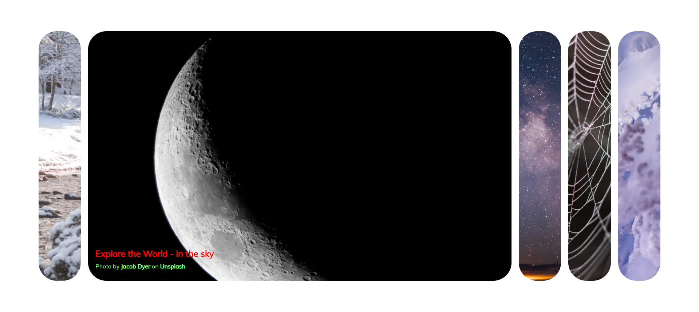

# Portfolio_Web_JS_01_ExpandingCards
50 Projects In 50 Days - HTML, CSS &amp; Javascript (Udemy)

[Home](./READEME.md)

Simple Card (as image tiles) expansion and contraction according to mouse click.

