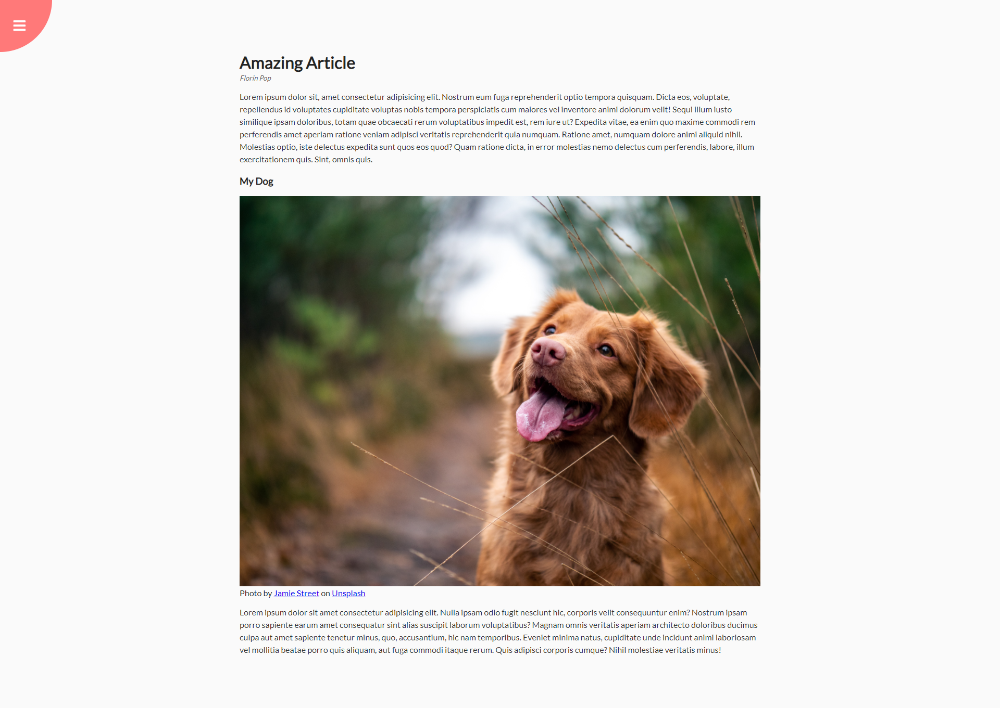

# Portfolio - Web JavaScript 03 Rotation Navigation
50 Projects In 50 Days - HTML, CSS &amp; Javascript (Udemy)

<!-- [Home](/README.md) or this [Home](/../../) works 
- first links to file in root "/"
- second links to base "Portfolio" folder going down from root "/" through "main" then "blob"
-- note blob for files and tree for directories so need to link to files -->

[Home](/README.md)

Page with quarter circle menu button top left that when pressed, swings the content round in a circle to the right to reveal angled menu at bottom left of page.
Almost all css rather than JavaScript.

\

